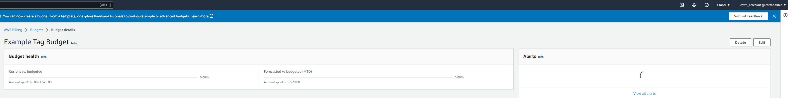

# Week 0 — Billing and Architecture

## Required Homework

### Create Billing Alert

### Create Budget
This budget was created for $20. I have another budget rule in place because I have had this account for over 5 years.

### Create Budget Alert

### Logical Diagram 

[Lucid Charts Share Link](https://lucid.app/lucidchart/1ecee674-b559-4268-a28e-3c95517323dd/edit?viewport_loc=-8%2C-881%2C4245%2C1588%2C0_0&invitationId=inv_c698acc2-ceeb-40b3-a8bf-c71dfbad8799)

CI/CD
Insert

## Homework Challenges

### Create EventBridge

### Create EventBridge SNS Topic w/subscription

